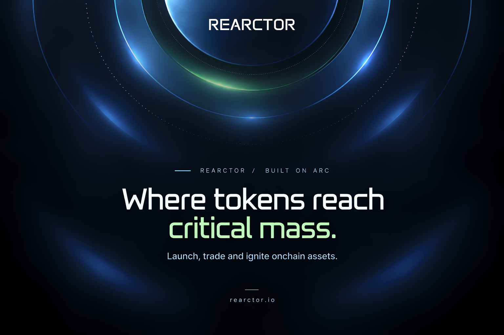

  

## About Rearctor

Rearctor is a token launch protocol built for Arc. It takes a token along a single
deterministic path: deployment, USDC-denominated price discovery, critical mass,
atomic graduation, and permanent Uniswap V4 liquidity.

**Launch → Trade → Reach critical mass → Migrate liquidity → Generate ongoing fees**

Every launch is called a **reaction**. A reaction is not a listing or a campaign -
it is a lifecycle with a fixed starting supply, a defined market denomination, and a
single threshold that decides when it graduates.

The parameters that govern a reaction are set at deployment. Supply is fixed, the
ignition threshold is a constant, and migration is unconditional once that threshold
is crossed. Critical economic parameters established at launch - including the
reaction's trading-fee configuration - are intentionally immutable. Administrative
execution of reserved buyback and reinvestment budgets still exists through the
Control Room.

## How Rearctor works

Every reaction begins with a fixed initial supply of **1,000,000,000 tokens**. The
market is denominated in **USDC**, not in the chain's native asset, so price discovery
is read directly in stable terms from the first trade onward.

During the launch lifecycle, participants buy and sell through Rearctor's
USDC-denominated bonding curve. Each buy moves price up the curve and adds to
reserves; each sell moves back down it.

The reaction accumulates USDC reserves as trading progresses toward the predefined
5,042 USDC ignition threshold.

When reserves reach **5,042 USDC**, ignition occurs. Graduation and liquidity
migration execute inside the same transaction: the trade that crosses the threshold
is the trade that migrates the pool. No separate keeper call, no queued graduation,
no manual step. After ignition, trading continues on Uniswap V4.

### Dev buy

A creator may optionally execute a **dev buy** during launch. It is not a separate
allocation mechanism or a discounted tranche:

- it follows the same bonding curve as every other purchase;
- it pays the configured trading fees;
- it may acquire up to **20% of the initial token supply**;
- it cannot complete the bonding curve during the launch transaction.

## Reaction lifecycle

**Spark → Charging → Critical Mass → Ignition → Expansion**

| Stage | |
| :--- | :--- |
| **Spark** | The reaction is deployed with its fixed initial supply of 1,000,000,000 tokens and its immutable fee configuration. |
| **Charging** | Price discovery runs on the USDC-denominated bonding curve. Buys and sells move price along the curve and build reserves. |
| **Critical Mass** | Reserves approach the 5,042 USDC threshold. The reaction is still trading on the curve and has not yet migrated. |
| **Ignition** | The threshold transaction atomically graduates the reaction and migrates liquidity into a full-range Uniswap V4 position. |
| **Expansion** | The migrated pool continues trading and continues generating fees under the same distribution. |

Three properties are worth stating explicitly:

- **No early graduation.** A reaction cannot be migrated ahead of the threshold by
  the creator, by the protocol, or by any privileged caller.
- **At least 20% of initial supply migrates** into the Uniswap V4 position at ignition.
- **Migration occurs at the final bonding-curve price**, with the final curve
  interaction and liquidity migration executed inside the same transaction.

## Fee model

Each reaction defines its buy and sell fee configuration at launch. Trading fees may
be configured between **1% and 10%**, and those rates cannot be upgraded or changed
after deployment.

Immutability here is a property of the deployed reaction rather than a commitment
made about it: the rates are fixed at the moment of launch, and remain fixed for the
creator and for the protocol alike.

Every fee collected is split:

| Share | Destination |
| :--- | :--- |
| **30%** | Rearctor protocol |
| **70%** | Reaction allocation |

The reaction allocation may include creator revenue, token buybacks, and liquidity
reinvestment.

**Wallet-to-wallet transfers are not taxed.** Fees apply to trading, not to moving
tokens between addresses.

## Ignition & Uniswap V4

The ignition threshold is **5,042 USDC** in reserves. The transaction that crosses
that threshold performs the migration itself - no separate keeper transaction and no
distinct graduation transaction are required.

The migration and final bonding-curve interaction execute inside the same
transaction, minimizing the intermediate state between bonding-curve trading and the
migrated Uniswap V4 pool.

At ignition, liquidity is deployed into a **full-range Uniswap V4 position**. Rearctor
attaches a hook to that pool so the directional buy and sell fees configured at launch
continue to apply to the Rearctor-managed migrated pool. Other pools for the same
token are outside that hook's scope.

## Permanent liquidity

Migrated liquidity is designed to be permanent.

There is **no principal-withdrawal function** for the migrated position. The creator
cannot later withdraw the underlying migrated liquidity through Rearctor's contracts.

This is a structural property of the migrated position rather than a discretionary
policy - the withdrawal path does not exist to be exercised, so it does not depend on
who holds administrative access or on how they choose to use it.

## Revenue after ignition

Ignition does not end the fee model. The migrated Uniswap V4 position continues to
generate fees as it trades, and collected revenue continues to follow the same
distribution:

**30% Rearctor protocol · 70% reaction allocation**

This applies to both USDC receipts and token receipts, excluding any fee charged
directly by the underlying Uniswap protocol.

The distribution is therefore continuous across the lifecycle: the same 30/70 split
that governs curve trading during Charging governs pool trading during Expansion.

## Protocol properties

| | |
| :--- | :--- |
| Chain | Arc |
| Initial supply | 1,000,000,000 |
| Market denomination | USDC |
| Trading fees | 1%–10%, immutable |
| Protocol share | 30% |
| Reaction allocation | 70% |
| Ignition threshold | 5,042 USDC |
| Migration | Atomic |
| Minimum migrated supply | 20% |
| Liquidity | Full-range Uniswap V4 |
| Principal withdrawal | None |
| Wallet transfers | Untaxed |

## Interfaces

- **Launch Console** - create a reaction and configure it before deployment, including
  its buy and sell fee configuration.
- **Portfolio** - track user activity and positions across reactions.
- **Analytics** - protocol-level activity and reaction monitoring.
- **Control Room** - reaction administration, including the reserved buyback and
  liquidity reinvestment budgets drawn from the reaction allocation.

Administrative access does not extend to changing immutable launch fees or
withdrawing migrated liquidity principal. Those constraints hold regardless of who
is operating the reaction.

## REARC

**REARC** is the Rearctor protocol token.

## Rearctor Research

Rearctor Research explores potential extensions to the reaction lifecycle beyond the
core protocol.

These repositories document concept and research directions. They are not deployed
production features.

| Repository | What it explores |
| :--- | :--- |
| [reaction-modules](https://github.com/Rearctor/reaction-modules) | Modular mechanics for configurable reactions |
| [autopilot](https://github.com/Rearctor/autopilot) | Rule-based execution for buybacks and liquidity reinvestment |
| [signal](https://github.com/Rearctor/signal) | Onchain telemetry and creator/reaction signals |
| [live-reactor](https://github.com/Rearctor/live-reactor) | Real-time discovery, monitoring and ignition alerts |
| [expansion](https://github.com/Rearctor/expansion) | Post-ignition cross-ecosystem research |

## Explore

[Website](https://rearctor.io) · [Docs](https://rearctor.io/docs) · [X](https://x.com/JoinRearctor) · [Telegram](https://t.me/rearctor)

---

**From Spark to Ignition.**

